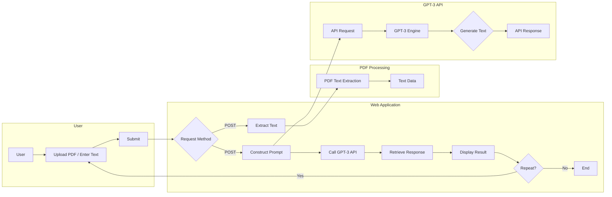

# Policy-scanner
- Takes the pdf of an updated policy and tells whether it affects a respective company or not.
- Useful for companies to track if an update on policy affects them or not, and if yes then how it affects the company.
- Made using OpenAI's GPT 3.5 API.

## FLowchart explaination 


## Dependencies 
```
OpenAI
Flask
PyPDF2
```

## Installation
```
1. pip install required libraries
2. connect your OpenAI API Key
3. run the flask app
4. results on port 5000 (http://127.0.0.1:5000)
```
